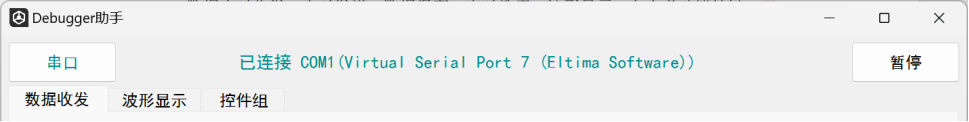
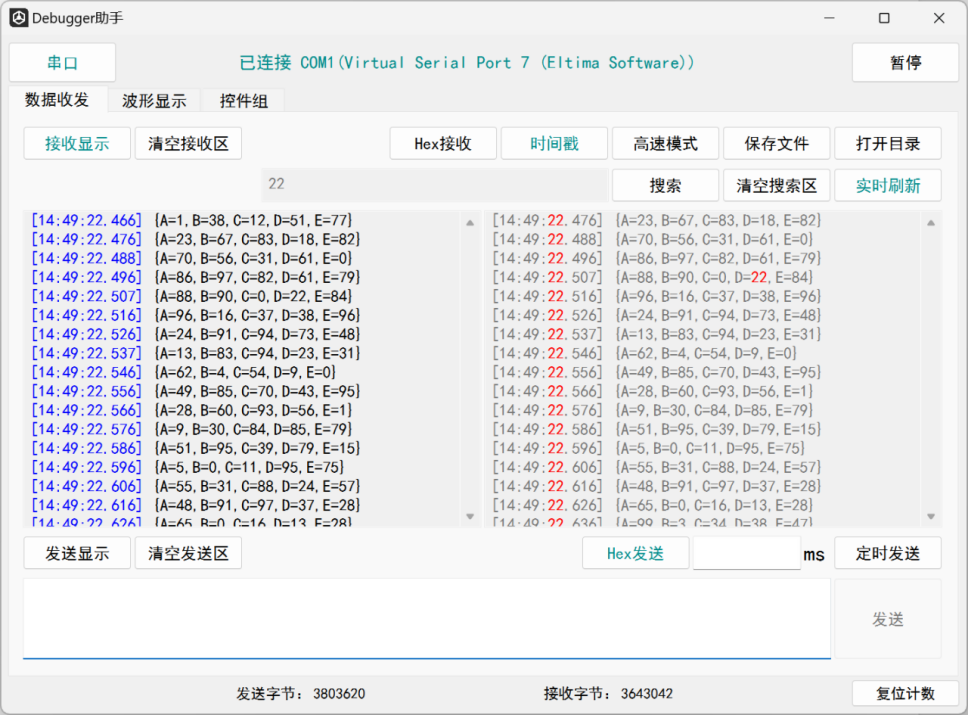
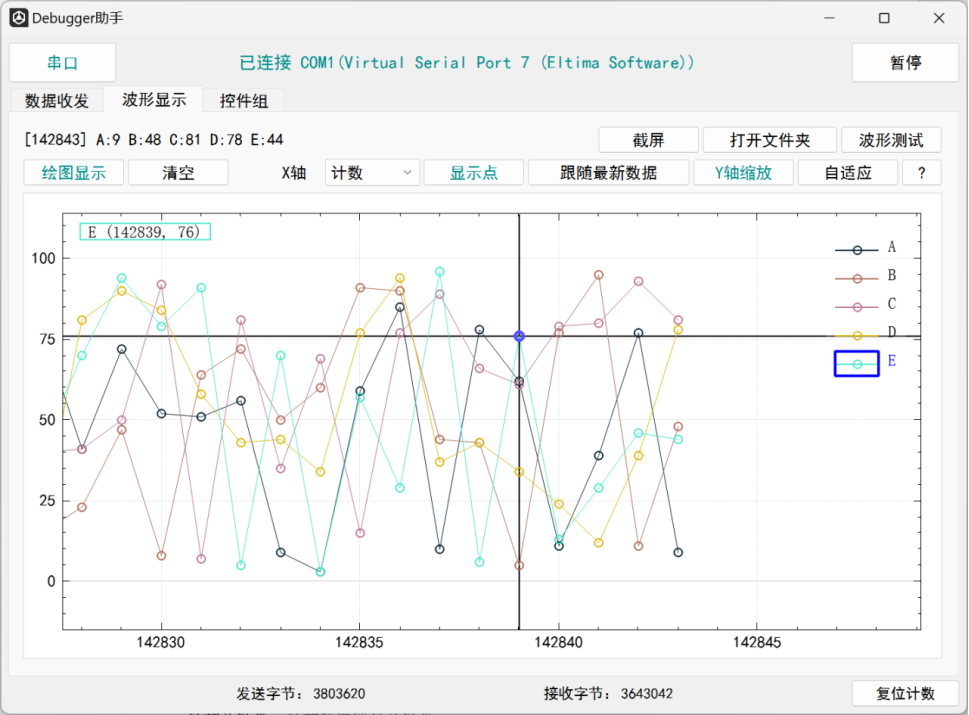
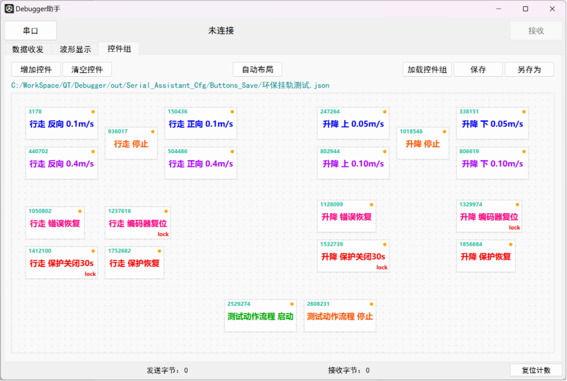
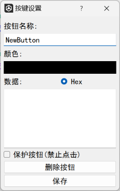

# Debugger调试助手

## 一、软件概述

### 开发及编译工具：
- Qt 5.15.2 MSVC2019 64bit

### 连接方式：
- 串口

### 功能：
- 数据实时收发
- 定时发送
- 数据保存
- 实时搜索
- 波形显示
- 自定义功能按键
- 配置自动保存

### 适用速率：
- ≤100Hz，Max 1kHz

### 串口波特率支持：
- 300-460800

### 最大曲线数量：
- 10条

## 二、使用说明
- .exe直接使用，注意：会自动在软件同目录下创建配置保存文件夹。

## 三、软件界面及功能介绍

### 1. 通用部分

#### 按键及功能介绍：
- 串口：弹出串口配置界面
- 已连接****：显示连接信息
- 暂停/接收：点击切换数据接收使能
- 串口收发、波形显示：功能页，可双击创建独立窗口
- 发送字节、接收字节：发送、接收字节计数 单位Byte
- 复位计数：复位字节计数显示，不清除接收缓存

### 2. 数据收发页

#### 按键及功能介绍：
- 接收显示：开/关接收显示刷新
- 清空接收区：清空接收显示区域以及缓存
- 时间戳：开/关自动时间戳 时间戳格式为HH:MM:SS:mm
- 高速模式：开/关高速模式，开启后仅缓存最新100条数据，且不会触发自动保存。提高稳定性，适用于高频数据的实时监控
- Hex接收：切换16进制显示模式和ASCII字符串显示模式（只对新接收到的数据有效，已缓存数据不会改变显示模式）
- 保存文件：将显示区数据保存为.txt文件（数据会在大于1Mb时自动清空缓存并保存）
- 打开目录：打开数据手动保存/自动保存文件夹
- 搜索输入框、搜索：在显示区搜索指定字符串，并在搜索窗口显示。
- 清空搜索区：清空搜索显示窗口内容
- 实时刷新：开/关搜索结果跟随显示区的实时刷新功能
- 清空发送区：清空发送输入框
- 发送显示：开/关上方显示区是否显示发送内容
- Hex发送：切换发送输入框16进制输入模式和ASCII字符串输入模式
- 定时发送输入框、定时发送：开/关定时发送功能（定时发送最低10ms间隔，定时发送时禁止修改发送内容）
- 发送输入框、发送：发送输入的内容（16进制发送模式下，若输入内容不合法则发送按钮不可点击）

### 3. 波形显示页

#### 按键及功能介绍：
- 实时数据显示区：显示[计数]以及最新点的数据
- 截屏：截取当前显示区的画面，并保存
- 打开文件夹：打开截屏保存文件夹
- 波形测试：通过串口发送高频随机数据，用以绘图功能测试，需要开启两个该工具并使用模拟串口工具连接两个串口
- 绘图显示：开/关曲线绘图功能
- 清空：清空绘图区的已有曲线（绘图只显示最新的60*60*24个点）
- X轴单位选择：切换X轴坐标单位为接收计数和时间戳（切换单位将清空已有曲线）
- 显示点：开/关数据点的显示功能（会影响高频曲线绘制速度，高频下不建议开启）
- 跟随最新数据：开/关自动跟随最新数据功能，开启后最新数据将保持在显示区最右边。
- Y轴缩放/X轴缩放：切换滚轮缩放功能对应的轴
- 自适应：将非隐藏曲线以合适的大小显示，已隐藏的曲线不参与自适应
- ？：绘图功能说明以及曲线解码格式说明（曲线传输格式为字符串键值对）

#### 波形显示区内功能介绍：
- 波形显示区：可单击指定曲线选中该曲线，可鼠标左键拖动曲线，可鼠标滚轮缩放指定坐标（默认缩放X轴坐标，按下L_Ctrl再滚动则缩放Y轴坐标）
- 图例区：显示当前所有曲线的颜色和命名，右键可以自定义曲线颜色，单击可以选择曲线，双击可以显示/隐藏该曲线
- 光标、光标坐标显示：跟随鼠标显示已选择曲线的指定点坐标

### 4. 控件组页

#### 按键及功能介绍：
- 增加控件：点击后增加一个按键
- 清空控件：点击后清空全部按键
- 自动布局：点击后所有按键按照添加顺序从左上角开始按顺序排列
- 加载控件组（ctrl+o）：加载保存的控件页面（包括按键的发送数据、名字、颜色、位置等）
- 保存（ctrl+s）：保存修改到原文件
- 另存为（ctrl+shift+s）：另存为当前控件页面
- 按键：左上角为该按键id，右上角为发送状态指示，右下角为锁定标志。中间为按键名。按键左键点击发送指定数据，右键点击打开按键设置弹窗，右键长按拖动位置。
- 按键设置弹窗：设置按键名称、文字颜色、发送的数据（支持hex和ASCII字符串），保护锁定、删除按钮和保存修改。

## 四、更新日志

### 24/5/29：
- 增加功能说明文档
- 修复配置文件夹无法创建，数据无法保存bug
- 修复分辨率异常
- 修复数据收发页独立窗口闪退
- 暂时删除未开发功能按钮
- 修复定时发送功能

### 24/6/18：
- 增加自定义按键（按键组页面）功能
- 修复崩溃bug
- 修复其他bug

### 24/7/10：
- 增加接收数据的本地缓存线程，绘图卡顿不再会影响数据收发和曲线绘制
- 优化曲线绘制线程，曲线绘制时可以选中曲线并显示追踪器，不再需要暂停绘图
- 增加.ini配置文件自动存储/加载部分按键状态和串口等配置信息
- 按键组界面增加路径显示，增加保存以及另存为按钮
- 按键组界面增加ctrl+s保存组合键
- 修复接收显示框实时搜索功能异常
- 更新说明文档